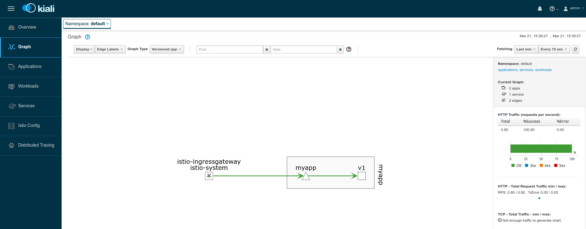
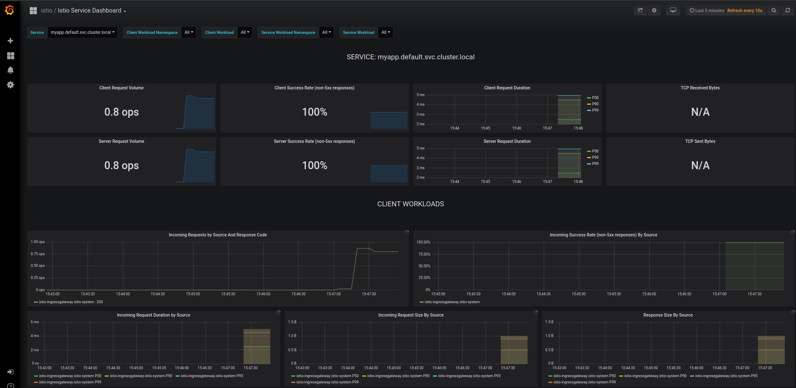
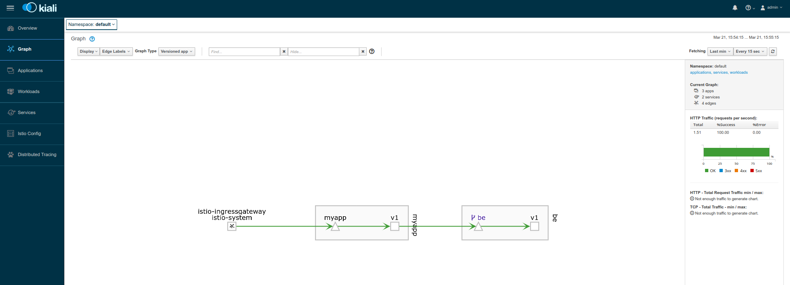
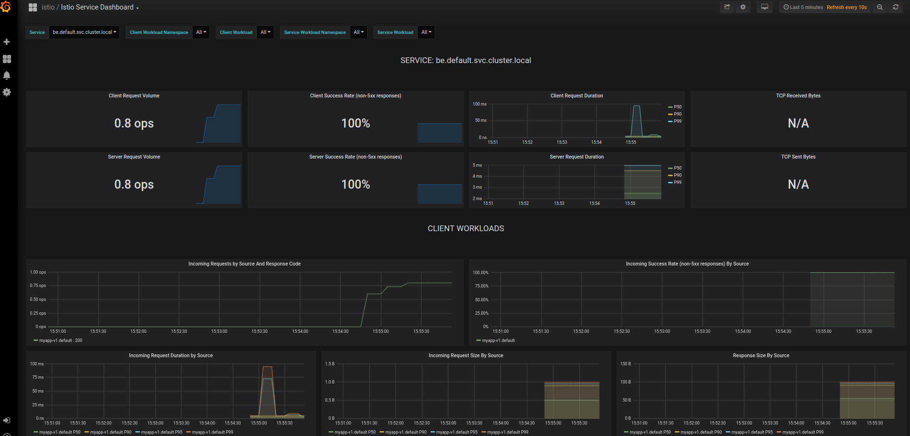
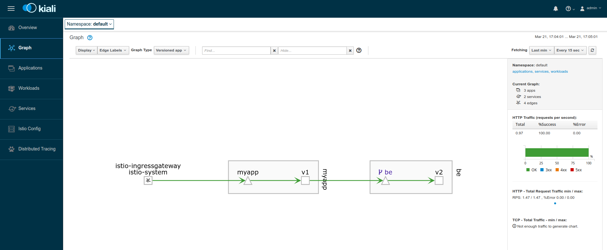
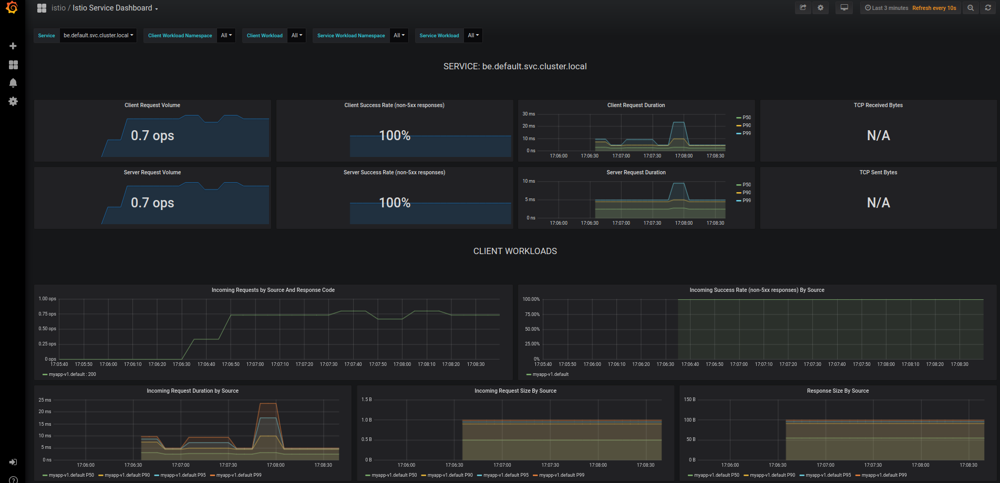
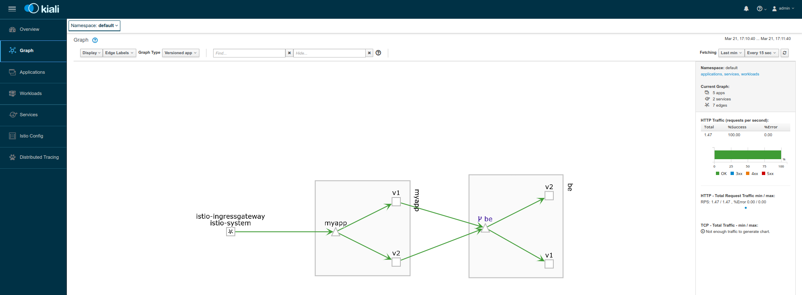
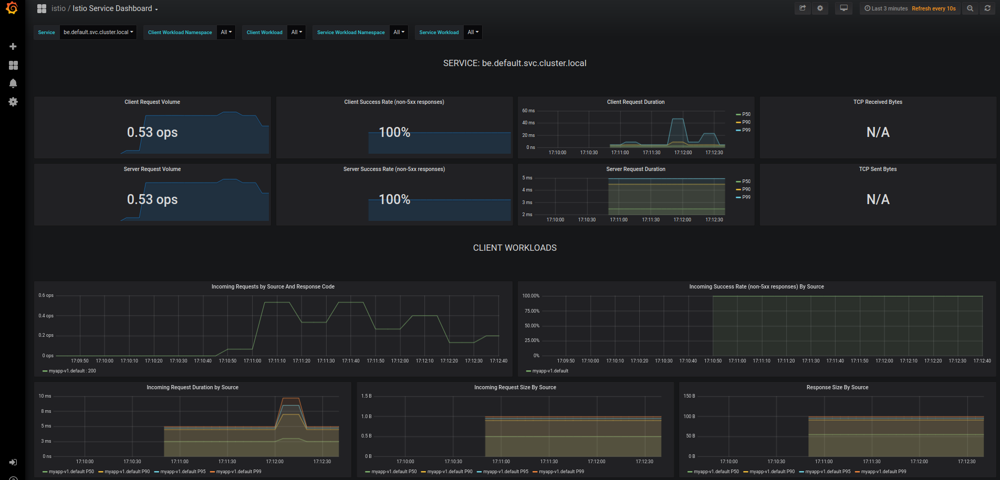
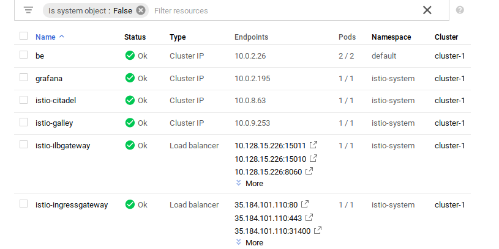
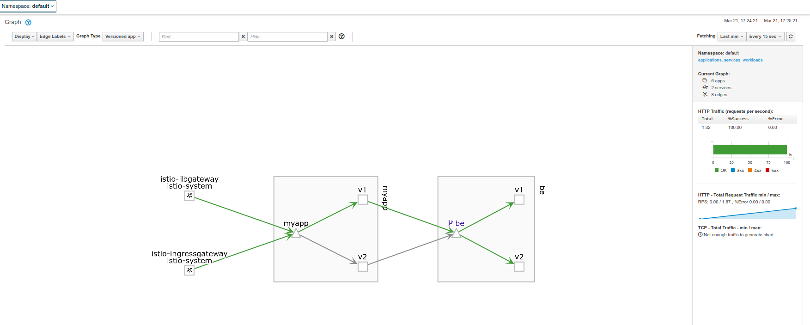

# Istio "Hello World" my way

## What is this repo?

This is a really simple application I wrote over holidays a year ago (12/17) that details my experiences and
feedback with istio.  To be clear, its a really basic NodeJS application that i used here but more importantly, it covers
the main sections of [Istio](https://istio.io/) that i was seeking to understand better (if even just as a helloworld).  

I do know isito has the "[bookinfo](https://github.com/istio/istio/tree/master/samples/bookinfo)" application but the best way
i understand something is to rewrite sections and only those sections from the ground up.

## Istio version used

* 03/10/19:  Istio 1.1.0
* 01/09/19:  Istio 1.0.5
* [Prior Istio Versions](https://github.com/salrashid123/istio_helloworld/tags)


## What i tested

- [Basic istio Installation on Google Kubernetes Engine](#lets-get-started)
- [Grafana, Prometheus, Kiali, Jaeger](#setup-some-tunnels-to-each-of-the-services)
- [Route Control](#route-control)
- [Canary Deployments with VirtualService](#canary-deployments-with-virtualservice)
- [Destination Rules](#destination-rules)
- [Egress Rules](#egress-rules)
- [Egress Gateway](#egress-gateway)
- [LUA HttpFilter](#lua-httpfilter)
- [Authorization](#autorization)
- [Internal LoadBalancer (GCP)](#internal-loadbalancer)
- [Mixer Out of Process Authorization Adapter](https://github.com/salrashid123/istio_custom_auth_adapter)
- [Access GCE MetadataServer](#access-GCE-metadataServer)

## What is the app you used?

NodeJS in a Dockerfile...something really minimal.  You can find the entire source under the 'nodeapp' folder in this repo.

The endpoints on this app are as such:

- ```/```:  Does nothing;  ([source](https://github.com/salrashid123/istio_helloworld/blob/master/nodeapp/app.js#L24))
- ```/varz```:  Returns all the environment variables on the current Pod ([source](https://github.com/salrashid123/istio_helloworld/blob/master/nodeapp/app.js#L33))
- ```/version```: Returns just the "process.env.VER" variable that was set on the Deployment ([source](https://github.com/salrashid123/istio_helloworld/blob/master/nodeapp/app.js#L37))
- ```/backend```: Return the nodename, pod name.  Designed to only get called as if the applciation running is a `backend` ([source](https://github.com/salrashid123/istio_helloworld/blob/master/nodeapp/app.js#L41))
- ```/hostz```:  Does a DNS SRV lookup for the `backend` and makes an http call to its `/backend`, endpoint ([source](https://github.com/salrashid123/istio_helloworld/blob/master/nodeapp/app.js#L45))
- ```/requestz```:  Makes an HTTP fetch for several external URLs (used to show egress rules) ([source](https://github.com/salrashid123/istio_helloworld/blob/master/nodeapp/app.js#L120))
- ```/headerz```:  Displays inbound headers
 ([source](https://github.com/salrashid123/istio_helloworld/blob/master/nodeapp/app.js#L115))
- ```/metadata```: Access the GCP MetadataServer using hostname and link-local IP address ([source](https://github.com/salrashid123/istio_helloworld/blob/master/nodeapp/app.js#L125))
- ```/remote```: Access `/backend` while deployed in a remote istio cluster  ([source](https://github.com/salrashid123/istio_helloworld/blob/master/nodeapp/app.js#L145))

I build and uploaded this app to dockerhub at

```
docker.io/salrashid123/istioinit:1
docker.io/salrashid123/istioinit:2
```

(basically, they're both the same application but each has an environment variable that signifies which 'verison; they represent.  The version information for each image is returned by the `/version` endpoint)

You're also free to build and push these images directly:
```
docker build  --build-arg VER=1 -t your_dockerhub_id/istioinit:1 .
docker build  --build-arg VER=2 -t your_dockerhub_id/istioinit:2 .

docker push your_dockerhub_id/istioinit:1
docker push your_dockerhub_id/istioinit:2
```

To give you a sense of the differences between a regular GKE specification yaml vs. one modified for istio, you can compare:
- [all-istio.yaml](all-istio.yaml)  vs [all-gke.yaml](all-gke.yaml)
(review Ingress config, etc)

## Lets get started

### Create a 1.10+ GKE Cluster and Bootstrap Istio

Note, the collowing cluster is setup with a  [aliasIPs](https://cloud.google.com/kubernetes-engine/docs/how-to/alias-ips) (`--enable-ip-alias` )

```bash

gcloud container  clusters create cluster-1 --machine-type "n1-standard-2" --zone us-central1-a  --num-nodes 4 --enable-ip-alias

gcloud container clusters get-credentials cluster-1 --zone us-central1-a

kubectl create clusterrolebinding cluster-admin-binding --clusterrole=cluster-admin --user=$(gcloud config get-value core/account)

kubectl create ns istio-system

export ISTIO_VERSION=1.1.0
wget https://github.com/istio/istio/releases/download/$ISTIO_VERSION/istio-$ISTIO_VERSION-linux.tar.gz
tar xvzf istio-$ISTIO_VERSION-linux.tar.gz

wget https://storage.googleapis.com/kubernetes-helm/helm-v2.11.0-linux-amd64.tar.gz
tar xf helm-v2.11.0-linux-amd64.tar.gz

export PATH=`pwd`/istio-$ISTIO_VERSION/bin:`pwd`/linux-amd64/:$PATH

helm template istio-$ISTIO_VERSION/install/kubernetes/helm/istio-init --name istio-init --namespace istio-system | kubectl apply -f -

# https://github.com/istio/istio/tree/master/install/kubernetes/helm/istio#configuration
# https://istio.io/docs/reference/config/installation-options/

helm template istio-$ISTIO_VERSION/install/kubernetes/helm/istio --name istio --namespace istio-system  \
   --set prometheus.enabled=true \
   --set servicegraph.enabled=true \
   --set grafana.enabled=true \
   --set tracing.enabled=true \
   --set sidecarInjectorWebhook.enabled=true \
   --set gateways.istio-ilbgateway.enabled=true \
   --set global.outboundTrafficPolicy.mode=REGISTRY_ONLY \
   --set gateways.istio-egressgateway.enabled=true \
   --set global.mtls.enabled=true > istio.yaml


kubectl apply -f istio.yaml
kubectl apply -f istio-ilbgateway-service.yaml

kubectl label namespace default istio-injection=enabled


export USERNAME=$(echo -n 'admin' | base64)
export PASSPHRASE=$(echo -n 'admin' | base64)
export NAMESPACE=istio-system

echo '
apiVersion: v1
kind: Secret
metadata:
  name: kiali
  namespace: $NAMESPACE
  labels:
    app: kiali
type: Opaque
data:
  username: $USERNAME
  passphrase: $PASSPHRASE           
' | envsubst > kiali_secret.yaml

kubectl apply -f kiali_secret.yaml

export KIALI_OPTIONS=" --set kiali.enabled=true "
KIALI_OPTIONS=$KIALI_OPTIONS"  --set kiali.dashboard.grafanaURL=http://localhost:3000"
KIALI_OPTIONS=$KIALI_OPTIONS" --set kiali.dashboard.jaegerURL=http://localhost:16686"
helm template istio-$ISTIO_VERSION/install/kubernetes/helm/istio --name istio --namespace istio-system $KIALI_OPTIONS  > istio_kiali.yaml

kubectl apply -f istio_kiali.yaml
```

Wait maybe 2 to 3 minutes and make sure all the Deployments are live:

- For reference, here are the Istio [installation options](https://istio.io/docs/reference/config/installation-options/)

### Make sure the Istio installation is ready

Verify this step by makeing sure all the ```Deployments``` are Available.

```bash
$ kubectl get no,po,rc,svc,ing,deployment -n istio-system
NAME                                            STATUS    ROLES     AGE       VERSION
node/gke-cluster-1-default-pool-21eaedac-dn3f   Ready     <none>    15m       v1.11.7-gke.4
node/gke-cluster-1-default-pool-21eaedac-jmqc   Ready     <none>    15m       v1.11.7-gke.4
node/gke-cluster-1-default-pool-21eaedac-rg9g   Ready     <none>    15m       v1.11.7-gke.4
node/gke-cluster-1-default-pool-21eaedac-szgb   Ready     <none>    15m       v1.11.7-gke.4

NAME                                          READY     STATUS      RESTARTS   AGE
pod/grafana-7b46bf6b7c-g7v7b                  1/1       Running     0          5m
pod/istio-citadel-75fdb679db-bm6ct            1/1       Running     0          5m
pod/istio-cleanup-secrets-1.1.0-6k6mw         0/1       Completed   0          5m
pod/istio-egressgateway-75d546b87f-prqw2      1/1       Running     0          5m
pod/istio-galley-c864b5c86-sz4sq              1/1       Running     0          5m
pod/istio-grafana-post-install-1.1.0-8xx8r    0/1       Completed   0          5m
pod/istio-ilbgateway-685bddb658-9zkss         1/1       Running     0          5m
pod/istio-ingressgateway-668676fbdb-jhhgz     1/1       Running     0          5m
pod/istio-init-crd-10-gkzcd                   0/1       Completed   1          11m
pod/istio-init-crd-11-89ssc                   0/1       Completed   2          11m
pod/istio-pilot-f4c98cfbf-cqxlr               2/2       Running     0          5m
pod/istio-policy-6cbbd844dd-w7z5j             2/2       Running     3          5m
pod/istio-security-post-install-1.1.0-s2qml   0/1       Completed   0          5m
pod/istio-sidecar-injector-7b47cb4689-sxzlp   1/1       Running     0          5m
pod/istio-telemetry-ccc4df498-rzmtx           2/2       Running     4          5m
pod/istio-tracing-75dd89b8b4-gjnkh            1/1       Running     0          5m
pod/kiali-5d68f4c676-8z6zd                    1/1       Running     0          2m
pod/prometheus-89bc5668c-f9kzd                1/1       Running     0          5m
pod/servicegraph-5d4b49848-7gffl              1/1       Running     1          5m

NAME                             TYPE           CLUSTER-IP    EXTERNAL-IP      PORT(S)                                                                                                                                      AGE
service/grafana                  ClusterIP      10.0.2.195    <none>           3000/TCP                                                                                                                                     5m
service/istio-citadel            ClusterIP      10.0.8.63     <none>           8060/TCP,15014/TCP                                                                                                                           5m
service/istio-galley             ClusterIP      10.0.9.253    <none>           443/TCP,15014/TCP,9901/TCP                                                                                                                   5m
service/istio-ilbgateway         LoadBalancer   10.0.7.101    10.128.15.226    15011:32311/TCP,15010:32360/TCP,8060:32427/TCP,5353:30728/TCP,443:31124/TCP                                                                  5m
service/istio-ingressgateway     LoadBalancer   10.0.10.117   35.184.101.110   80:31380/TCP,443:31390/TCP,31400:31400/TCP,15029:30266/TCP,15030:30818/TCP,15031:30590/TCP,15032:31962/TCP,15443:31628/TCP,15020:31509/TCP   5m
service/istio-pilot              ClusterIP      10.0.11.242   <none>           15010/TCP,15011/TCP,8080/TCP,15014/TCP                                                                                                       5m
service/istio-policy             ClusterIP      10.0.9.90     <none>           9091/TCP,15004/TCP,15014/TCP                                                                                                                 5m
service/istio-sidecar-injector   ClusterIP      10.0.14.149   <none>           443/TCP                                                                                                                                      5m
service/istio-telemetry          ClusterIP      10.0.9.12     <none>           9091/TCP,15004/TCP,15014/TCP,42422/TCP                                                                                                       5m
service/jaeger-agent             ClusterIP      None          <none>           5775/UDP,6831/UDP,6832/UDP                                                                                                                   5m
service/jaeger-collector         ClusterIP      10.0.10.230   <none>           14267/TCP,14268/TCP                                                                                                                          5m
service/jaeger-query             ClusterIP      10.0.14.221   <none>           16686/TCP                                                                                                                                    5m
service/kiali                    ClusterIP      10.0.1.104    <none>           20001/TCP                                                                                                                                    2m
service/prometheus               ClusterIP      10.0.0.105    <none>           9090/TCP                                                                                                                                     5m
service/servicegraph             ClusterIP      10.0.12.131   <none>           8088/TCP                                                                                                                                     5m
service/tracing                  ClusterIP      10.0.13.7     <none>           80/TCP                                                                                                                                       5m
service/zipkin                   ClusterIP      10.0.14.119   <none>           9411/TCP                                                                                                                                     5m

NAME                                           DESIRED   CURRENT   UP-TO-DATE   AVAILABLE   AGE
deployment.extensions/grafana                  1         1         1            1           5m
deployment.extensions/istio-citadel            1         1         1            1           5m
deployment.extensions/istio-galley             1         1         1            1           5m
deployment.extensions/istio-ilbgateway         1         1         1            1           5m
deployment.extensions/istio-ingressgateway     1         1         1            1           5m
deployment.extensions/istio-pilot              1         1         1            1           5m
deployment.extensions/istio-policy             1         1         1            1           5m
deployment.extensions/istio-sidecar-injector   1         1         1            1           5m
deployment.extensions/istio-telemetry          1         1         1            1           5m
deployment.extensions/istio-tracing            1         1         1            1           5m
deployment.extensions/kiali                    1         1         1            1           2m
deployment.extensions/prometheus               1         1         1            1           5m
deployment.extensions/servicegraph             1         1         1            1           5m

```


### Make sure the Istio an IP for the ```LoadBalancer``` is assigned:

Run

```
kubectl get svc istio-ingressgateway -n istio-system

export GATEWAY_IP=$(kubectl -n istio-system get service istio-ingressgateway -o jsonpath='{.status.loadBalancer.ingress[0].ip}')
echo $GATEWAY_IP
```


### Setup some tunnels to each of the services

Open up several new shell windows and type in one line into each:
```
kubectl -n istio-system port-forward $(kubectl -n istio-system get pod -l app=grafana -o jsonpath='{.items[0].metadata.name}') 3000:3000

kubectl port-forward -n istio-system $(kubectl get pod -n istio-system -l app=jaeger -o jsonpath='{.items[0].metadata.name}') 16686:16686

kubectl -n istio-system port-forward $(kubectl -n istio-system get pod -l app=kiali -o jsonpath='{.items[0].metadata.name}') 20001:20001
```

Open up a browser (4 tabs) and go to:
- Kiali http://localhost:20001/kiali (username: admin, password: admin)
- Grafana http://localhost:3000/dashboard/db/istio-mesh-dashboard
- Jaeger http://localhost:16686


### Deploy the sample application

The default ```all-istio.yaml``` runs:

- Ingress with SSL
- Deployments:
- - myapp-v1:  1 replica
- - myapp-v2:  1 replica
- - be-v1:  1 replicas
- - be-v2:  1 replicas

basically, a default frontend-backend scheme with one replicas for each `v1` and `v2` versions.

> Note: the default yaml pulls and run my dockerhub image- feel free to change this if you want.


```
kubectl apply -f all-istio.yaml
kubectl apply -f istio-lb-certs.yaml
```


```
kubectl apply -f istio-ingress-gateway.yaml
kubectl apply -f istio-ingress-ilbgateway.yaml

kubectl apply -f istio-fev1-bev1.yaml
```

Wait until the deployments complete:

```
$ kubectl get po,deployments,svc,ing
NAME                           READY     STATUS    RESTARTS   AGE
pod/be-v1-7c9c9d9bb7-s8pgz     2/2       Running   0          50s
pod/be-v2-6b47d48f6f-p8t5t     2/2       Running   0          49s
pod/myapp-v1-6748d578f-pzzst   2/2       Running   0          50s
pod/myapp-v2-b6cf849df-xqg8p   2/2       Running   0          50s

NAME                             DESIRED   CURRENT   UP-TO-DATE   AVAILABLE   AGE
deployment.extensions/be-v1      1         1         1            1           50s
deployment.extensions/be-v2      1         1         1            1           49s
deployment.extensions/myapp-v1   1         1         1            1           50s
deployment.extensions/myapp-v2   1         1         1            1           50s

NAME                 TYPE        CLUSTER-IP   EXTERNAL-IP   PORT(S)    AGE
service/be           ClusterIP   10.0.2.26    <none>        8080/TCP   50s
service/kubernetes   ClusterIP   10.0.0.1     <none>        443/TCP    19m
service/myapp        ClusterIP   10.0.7.114   <none>        8080/TCP   50s
```

Notice that each pod has two containers:  one is from isto, the other is the applicaiton itself (this is because we have automatic sidecar injection enabled on the `default` namespace).

Also note that in ```all-istio.yaml``` we did not define an ```Ingress``` object though we've defined a TLS secret with a very specific metadata name: ```istio-ingressgateway-certs```.  That is a special name for a secret that is used by Istio to setup its own ingress gateway:


#### Ingress Gateway Secret in 1.0.0+

Note the ```istio-ingress-gateway``` secret specifies the Ingress cert to use (the specific metadata name is special and is **required**)

```yaml
apiVersion: v1
data:
  tls.crt: _redacted_
  tls.key: _redacted_
kind: Secret
metadata:
  name: istio-ingressgateway-certs
  namespace: istio-system
type: kubernetes.io/tls
```

Remember we've acquired the ```$GATEWAY_IP``` earlier:

```bash
export GATEWAY_IP=$(kubectl -n istio-system get service istio-ingressgateway -o jsonpath='{.status.loadBalancer.ingress[0].ip}')
echo $GATEWAY_IP
```

### Send Traffic

This section shows basic user->frontend traffic and see the topology and telemetry in the Kiali and Grafana consoles:

#### Frontend only

So...lets send traffic with the ip to the ```/versions```  on the frontend

```bash
for i in {1..1000}; do curl -k  https://$GATEWAY_IP/version; sleep 1; done
```

You should see a sequence of 1's indicating the version of the frontend you just hit
```
111111111111111111111111111111111
```
(source: [/version](https://github.com/salrashid123/istio_helloworld/blob/master/nodeapp/app.js#L37) endpoint)

You should also see on kiali just traffic from ingress -> `fe:v1`



and in grafana:




#### Frontend and Backend

Now the next step in th exercise:

to send requests to ```user-->frontend--> backend```;  we'll use the  ```/hostz``` endpoint to do that.  Remember, the `/hostz` endpoint takes a frontend request, sends it to the backend which inturn echos back the podName the backend runs as.  The entire response is then returned to the user.  This is just a way to show the which backend host processed the requests.

(note i'm using  [jq](https://stedolan.github.io/jq/) utility to parse JSON)

```bash
for i in {1..1000}; do curl -s -k https://$GATEWAY_IP/hostz | jq '.[0].body'; sleep 1; done
```

you should see output indicating traffic from the v1 backend verison: ```be-v1-*```.  Thats what we expect since our original rule sets defines only `fe:v1` and `be:v1` as valid targets.

```bash
$ for i in {1..1000}; do curl -s -k https://$GATEWAY_IP/hostz | jq '.[0].body'; sleep 1; done

"pod: [be-v1-7c9c9d9bb7-s8pgz]    node: [gke-cluster-1-default-pool-21eaedac-rg9g]"
"pod: [be-v1-7c9c9d9bb7-s8pgz]    node: [gke-cluster-1-default-pool-21eaedac-rg9g]"
"pod: [be-v1-7c9c9d9bb7-s8pgz]    node: [gke-cluster-1-default-pool-21eaedac-rg9g]"
"pod: [be-v1-7c9c9d9bb7-s8pgz]    node: [gke-cluster-1-default-pool-21eaedac-rg9g]"
"pod: [be-v1-7c9c9d9bb7-s8pgz]    node: [gke-cluster-1-default-pool-21eaedac-rg9g]"
"pod: [be-v1-7c9c9d9bb7-s8pgz]    node: [gke-cluster-1-default-pool-21eaedac-rg9g]"
"pod: [be-v1-7c9c9d9bb7-s8pgz]    node: [gke-cluster-1-default-pool-21eaedac-rg9g]"
```

Note both Kiali and Grafana shows both frontend and backend service telemetry and traffic to ```be:v1```






## Route Control

This section details how to selectively send traffic to specific service versions and control traffic routing.

### Selective Traffic

In this sequence,  we will setup a routecontrol to:

1. Send all traffic to ```myapp:v1```.  
2. traffic from ```myapp:v1``` can only go to ```be:v2```

Basically, this is a convoluted way to send traffic from `fe:v1`-> `be:v2` even if all services and versions are running.

The yaml on ```istio-fev1-bev2.yaml``` would direct inbound traffic for ```myapp:v1``` to go to ```be:v2``` based on the ```sourceLabels:```.  The snippet for this config is:

```yaml
apiVersion: networking.istio.io/v1alpha3
kind: VirtualService
metadata:
  name: be-virtualservice
spec:
  gateways:
  - mesh
  hosts:
  - be
  http:
  - match:
    - sourceLabels:
        app: myapp
        version: v1
    route:
    - destination:
        host: be
        subset: v2
      weight: 100
---
apiVersion: networking.istio.io/v1alpha3
kind: DestinationRule
metadata:
  name: be-destination
spec:
  host: be
  trafficPolicy:
    tls:
      mode: ISTIO_MUTUAL
    loadBalancer:
      simple: ROUND_ROBIN
  subsets:
  - name: v1
    labels:
      version: v1
  - name: v2
    labels:
      version: v2
```

So lets apply the config with kubectl:

```
kubectl replace -f istio-fev1-bev2.yaml
```

After sending traffic,  check which backend system was called by invoking ```/hostz``` endpoint on the frontend.

What the ```/hostz``` endpoint does is takes a users request to ```fe-*``` and targets any ```be-*``` that is valid.  Since we only have ```fe-v1``` instances running and the fact we setup a rule such that only traffic from `fe:v1` can go to `be:v2`, all the traffic outbound for ```be-*``` must terminate at a ```be-v2```:

```bash
$ for i in {1..1000}; do curl -s -k https://$GATEWAY_IP/hostz | jq '.[0].body'; sleep 1; done

"pod: [be-v2-6b47d48f6f-p8t5t]    node: [gke-cluster-1-default-pool-21eaedac-dn3f]"
"pod: [be-v2-6b47d48f6f-p8t5t]    node: [gke-cluster-1-default-pool-21eaedac-dn3f]"
"pod: [be-v2-6b47d48f6f-p8t5t]    node: [gke-cluster-1-default-pool-21eaedac-dn3f]"
"pod: [be-v2-6b47d48f6f-p8t5t]    node: [gke-cluster-1-default-pool-21eaedac-dn3f]"
"pod: [be-v2-6b47d48f6f-p8t5t]    node: [gke-cluster-1-default-pool-21eaedac-dn3f]"
"pod: [be-v2-6b47d48f6f-p8t5t]    node: [gke-cluster-1-default-pool-21eaedac-dn3f]"
"pod: [be-v2-6b47d48f6f-p8t5t]    node: [gke-cluster-1-default-pool-21eaedac-dn3f]"
```

and on the frontend version is always one.
```bash
for i in {1..100}; do curl -k https://$GATEWAY_IP/version; sleep 1; done
11111111111111111111111111111
```

Note the traffic to ```be-v1``` is 0 while there is a non-zero traffic to ```be-v2``` from ```fe-v1```:






If we now overlay rules that direct traffic allow interleaved  ```fe(v1|v2) -> be(v1|v2)``` we expect to see requests to both frontend v1 and backend
```
kubectl replace -f istio-fev1v2-bev1v2.yaml
```

then frontend is both v1 and v2:
```bash
for i in {1..1000}; do curl -k  https://$GATEWAY_IP/version;  sleep 1; done
111211112122211121212211122211
```

and backend is responses comes from both be-v1 and be-v2

```bash
$ for i in {1..1000}; do curl -s -k https://$GATEWAY_IP/hostz | jq '.[0].body'; sleep 1; done

"pod: [be-v1-7c9c9d9bb7-s8pgz]    node: [gke-cluster-1-default-pool-21eaedac-rg9g]"
"pod: [be-v2-6b47d48f6f-p8t5t]    node: [gke-cluster-1-default-pool-21eaedac-dn3f]"
"pod: [be-v1-7c9c9d9bb7-s8pgz]    node: [gke-cluster-1-default-pool-21eaedac-rg9g]"
"pod: [be-v1-7c9c9d9bb7-s8pgz]    node: [gke-cluster-1-default-pool-21eaedac-rg9g]"
"pod: [be-v2-6b47d48f6f-p8t5t]    node: [gke-cluster-1-default-pool-21eaedac-dn3f]"
"pod: [be-v1-7c9c9d9bb7-s8pgz]    node: [gke-cluster-1-default-pool-21eaedac-rg9g]"
"pod: [be-v1-7c9c9d9bb7-s8pgz]    node: [gke-cluster-1-default-pool-21eaedac-rg9g]"
```






### Route Path

Now lets setup a more selective route based on a specific path in the URI:

- The rule we're defining is: "_First_ route requests to myapp where `path=/version` to only go to the ```v1``` set"...if there is no match, fall back to the default routes where you send `20%` traffic to `v1` and `80%` traffic to `v2`


```yaml
---
apiVersion: networking.istio.io/v1alpha3
kind: VirtualService
metadata:
  name: myapp-virtualservice
spec:
  hosts:
  - "*"
  gateways:
  - my-gateway
  http:
  - match:
    - uri:
        exact: /version
    route:
    - destination:
        host: myapp
        subset: v1
  - route:
    - destination:
        host: myapp
        subset: v1
      weight: 20
    - destination:
        host: myapp
        subset: v2
      weight: 80
```


```
kubectl replace -f istio-route-version-fev1-bev1v2.yaml
```

So check all requests to `/version` are `fe:v1`
```
for i in {1..1000}; do curl -k  https://$GATEWAY_IP/version; sleep 1; done
1111111111111111111
```

You may have noted how the route to any other endpoint other than `/version` destination is weighted split and not delcared round robin (eg:)
```yaml
  - route:
    - destination:
        host: myapp
        subset: v1
      weight: 20
    - destination:
        host: myapp
        subset: v2
      weight: 80
```

Anyway, now lets edit rule to  and change the prefix match to ```/xversion``` so the match *doesn't apply*.   What we expect is a request to http://gateway_ip/version will go to v1 and v2 (since the path rule did not match and the split is the fallback rule.

```
kubectl replace -f istio-route-version-fev1-bev1v2.yaml
```
Observe the version of the frontend you're hitting:

```bash
for i in {1..1000}; do curl -k  https://$GATEWAY_IP/version; sleep 1; done
2121212222222222222221122212211222222222222222
```

What you're seeing is ```myapp-v1``` now getting about `20%` of the traffic while ```myapp-v2``` gets `80%` because the previous rule doens't match.

Undo that change `/xversion` --> `/version` and reapply to baseline:

```
kubectl replace -f istio-route-version-fev1-bev1v2.yaml
```

#### Canary Deployments with VirtualService

You can use this traffic distribuion mechanism to run canary deployments between released versions.  For example, a rule like the following will split the traffic between `v1|v2` at `80/20` which you can use to gradually roll traffic over to `v2` by applying new percentage weights.


```yaml
apiVersion: networking.istio.io/v1alpha3
kind: VirtualService
metadata:
  name: myapp-virtualservice
spec:
  hosts:
  - "*"
  gateways:
  - my-gateway
  http:
  - route:
    - destination:
        host: myapp
        subset: v1
      weight: 80
    - destination:
        host: myapp
        subset: v2
      weight: 20
```
### Destination Rules

Lets configure Destination rules such that all traffic from ```myapp-v1``` round-robins to both version of the backend.

First lets  force all gateway requests to go to ```v1``` only:

on ```istio-fev1-bev1v2.yaml```:


```yaml
apiVersion: networking.istio.io/v1alpha3
kind: VirtualService
metadata:
  name: myapp-virtualservice
spec:
  hosts:
  - "*"
  gateways:
  - my-gateway
  http:
  - route:
    - destination:
        host: myapp
        subset: v1
```


And where the backend trffic is split between ```be-v1``` and ```be-v2``` with a ```ROUND_ROBIN```

```yaml
apiVersion: networking.istio.io/v1alpha3
kind: DestinationRule
metadata:
  name: be-destination
spec:
  host: be
  trafficPolicy:
    tls:
      mode: ISTIO_MUTUAL
    loadBalancer:
      simple: ROUND_ROBIN
  subsets:
  - name: v1
    labels:
      version: v1
  - name: v2
    labels:
      version: v2
```

After you apply the rule,

```
kubectl replace -f istio-fev1-bev1v2.yaml
```

you'll see frontend request all going to ```fe-v1```

```bash
for i in {1..1000}; do curl -k  https://$GATEWAY_IP/version; sleep 1; done
11111111111111
```

with backend requests coming from _pretty much_ round robin

```bash
$ for i in {1..1000}; do curl -s -k https://$GATEWAY_IP/hostz | jq '.[0].body'; sleep 1; done

"pod: [be-v2-6b47d48f6f-p8t5t]    node: [gke-cluster-1-default-pool-21eaedac-dn3f]"
"pod: [be-v1-7c9c9d9bb7-s8pgz]    node: [gke-cluster-1-default-pool-21eaedac-rg9g]"
"pod: [be-v2-6b47d48f6f-p8t5t]    node: [gke-cluster-1-default-pool-21eaedac-dn3f]"
"pod: [be-v1-7c9c9d9bb7-s8pgz]    node: [gke-cluster-1-default-pool-21eaedac-rg9g]"
"pod: [be-v2-6b47d48f6f-p8t5t]    node: [gke-cluster-1-default-pool-21eaedac-dn3f]"
"pod: [be-v2-6b47d48f6f-p8t5t]    node: [gke-cluster-1-default-pool-21eaedac-dn3f]"
"pod: [be-v1-7c9c9d9bb7-s8pgz]    node: [gke-cluster-1-default-pool-21eaedac-rg9g]"
"pod: [be-v2-6b47d48f6f-p8t5t]    node: [gke-cluster-1-default-pool-21eaedac-dn3f]"
"pod: [be-v1-7c9c9d9bb7-s8pgz]    node: [gke-cluster-1-default-pool-21eaedac-rg9g]"
"pod: [be-v1-7c9c9d9bb7-s8pgz]    node: [gke-cluster-1-default-pool-21eaedac-rg9g]"

```

Now change the ```istio-fev1-bev1v2.yaml```  to ```RANDOM``` and see response is from v1 and v2 random:
```bash
$ for i in {1..1000}; do curl -s -k https://$GATEWAY_IP/hostz | jq '.[0].body'; sleep 1; done

"pod: [be-v1-7c9c9d9bb7-s8pgz]    node: [gke-cluster-1-default-pool-21eaedac-rg9g]"
"pod: [be-v1-7c9c9d9bb7-s8pgz]    node: [gke-cluster-1-default-pool-21eaedac-rg9g]"
"pod: [be-v2-6b47d48f6f-p8t5t]    node: [gke-cluster-1-default-pool-21eaedac-dn3f]"
"pod: [be-v1-7c9c9d9bb7-s8pgz]    node: [gke-cluster-1-default-pool-21eaedac-rg9g]"
"pod: [be-v1-7c9c9d9bb7-s8pgz]    node: [gke-cluster-1-default-pool-21eaedac-rg9g]"
"pod: [be-v1-7c9c9d9bb7-s8pgz]    node: [gke-cluster-1-default-pool-21eaedac-rg9g]"
"pod: [be-v1-7c9c9d9bb7-s8pgz]    node: [gke-cluster-1-default-pool-21eaedac-rg9g]"
"pod: [be-v1-7c9c9d9bb7-s8pgz]    node: [gke-cluster-1-default-pool-21eaedac-rg9g]"
"pod: [be-v2-6b47d48f6f-p8t5t]    node: [gke-cluster-1-default-pool-21eaedac-dn3f]"
"pod: [be-v2-6b47d48f6f-p8t5t]    node: [gke-cluster-1-default-pool-21eaedac-dn3f]"
"pod: [be-v2-6b47d48f6f-p8t5t]    node: [gke-cluster-1-default-pool-21eaedac-dn3f]"
"pod: [be-v1-7c9c9d9bb7-s8pgz]    node: [gke-cluster-1-default-pool-21eaedac-rg9g]"
"pod: [be-v1-7c9c9d9bb7-s8pgz]    node: [gke-cluster-1-default-pool-21eaedac-rg9g]"

```

### Internal LoadBalancer

The configuration here  sets up an internal loadbalancer on GCP to access an exposed istio service.

The config settings that enabled this during istio initialization is

```
   --set gateways.istio-ilbgateway.enabled=true
```

and in this tutorial, applied as a `Service` with:

```
   kubectl apply -f istio-ilbgateway-service.yaml
```

The yaml above specifies the exposed port forwarding to the service.  In our case, the exported port is `https-> :443`:

```yaml
apiVersion: v1
kind: Service
metadata:
  name: istio-ilbgateway
  namespace: istio-system
  annotations:
    cloud.google.com/load-balancer-type: "internal"
  labels:
    chart: gateways
    heritage: Tiller
    release: istio
    app: istio-ilbgateway
    istio: ilbgateway
spec:
  type: LoadBalancer
  selector:
    app: istio-ilbgateway
    istio: ilbgateway
  ports:
    -
      name: grpc-pilot-mtls
      port: 15011
    -
      name: grpc-pilot
      port: 15010
    -
      name: tcp-citadel-grpc-tls
      port: 8060
      targetPort: 8060
    -
      name: tcp-dns
      port: 5353

    -
      name: https
      port: 443
```

( the other entries exposing ports (`grpc-pilot-mtls`, `grpc-pilot`) are uses for expansion and for this example, can be removed).

We also defined an ILB `Gateway`  earlier in `all-istio.yaml` as:

```yaml
apiVersion: networking.istio.io/v1alpha3
kind: Gateway
metadata:
  name: my-gateway-ilb
spec:
  selector:
    istio: ilbgateway
  servers:
  - port:
      number: 80
      name: http
      protocol: HTTP  
    hosts:
    - "*"
  - port:
      number: 443
      name: https
      protocol: HTTPS
    hosts:
    - "*"    
    tls:
      mode: SIMPLE
      serverCertificate: /etc/istio/ilbgateway-certs/tls.crt
      privateKey: /etc/istio/ilbgateway-certs/tls.key
 ```

As was `VirtualService` that specifies the valid inbound gateways that can connect to our service.  This configuration was defined when we applied `istio-fev1-bev1.yaml`:

```yaml
apiVersion: networking.istio.io/v1alpha3
kind: VirtualService
metadata:
  name: myapp-virtualservice
spec:
  hosts:
  - "*"
  gateways:
  - my-gateway
  - my-gateway-ilb  
  http:
  - route:
    - destination:
        host: myapp
        subset: v1
      weight: 100
```

Note the `gateways:` entry in the `VirtualService` includes `my-gateway-ilb` which is what defines `host:myapp, subset:v1` as a target for the ILB

```yaml
  gateways:
  - my-gateway
  - my-gateway-ilb
```

As mentioned above, we had to _manually_ specify the `port` the ILB will listen on for traffic inbound to this service.  For this example, the ILB listens on `:443` so we setup the `Service` with that port

```yaml
apiVersion: v1
kind: Service
metadata:
  name: istio-ilbgateway
  namespace: istio-system
  annotations:
    cloud.google.com/load-balancer-type: "internal"
...
spec:
  type: LoadBalancer
  selector:
    app: istio-ilbgateway
    istio: ilbgateway
  ports:
    -
      name: https
      port: 443
```

Finally, the certficates `Secret` mounted at `/etc/istio/ilbgateway-certs/` was specified this in the initial `all-istio.yaml` file:

```yaml
apiVersion: v1
data:
  tls.crt: LS0tLS1CR...
  tls.key: LS0tLS1CR...
kind: Secret
metadata:
  name: istio-ilbgateway-certs
  namespace: istio-system
type: kubernetes.io/tls
```

Now that the service is setup, acquire the ILB IP allocated

```bash
export ILB_GATEWAY_IP=$(kubectl -n istio-system get service istio-ilbgateway -o jsonpath='{.status.loadBalancer.ingress[0].ip}')
echo $ILB_GATEWAY_IP
```



Then from a GCE VM in the same VPC, send some traffic over on the internal address

```bash
you@gce-instance-1:~$ curl -vk https://10.128.15.226/

< HTTP/2 200 
< x-powered-by: Express
< content-type: text/html; charset=utf-8
< content-length: 19
< etag: W/"13-AQEDToUxEbBicITSJoQtsw"
< date: Fri, 22 Mar 2019 00:22:28 GMT
< x-envoy-upstream-service-time: 12
< server: istio-envoy
< 

Hello from Express!
```

- The Kiali console should show traffic from both gateways (if you recently sent traffic in externally and internally):



### Egress Rules

By default, istio blocks the cluster from making outbound requests.  There are several options to allow your service to connect externally:

* Egress Rules
* Egress Gateway
* Setting `global.proxy.includeIPRanges`

Egress rules prevent outbound calls from the server except with whiteliste addresses.

For example:

```yaml
apiVersion: networking.istio.io/v1alpha3
kind: ServiceEntry
metadata:
  name: bbc-ext
spec:
  hosts:
  - www.bbc.com
  ports:
  - number: 80
    name: http
    protocol: HTTP
  resolution: DNS
  location: MESH_EXTERNAL
---
apiVersion: networking.istio.io/v1alpha3
kind: ServiceEntry
metadata:
  name: google-ext
spec:
  hosts:
  - www.google.com
  ports:
  - number: 443
    name: https
    protocol: HTTPS
  resolution: DNS
  location: MESH_EXTERNAL
---
apiVersion: networking.istio.io/v1alpha3
kind: VirtualService
metadata:
  name: google-ext
spec:
  hosts:
  - www.google.com
  tls:
  - match:
    - port: 443
      sni_hosts:
      - www.google.com
    route:
    - destination:
        host: www.google.com
        port:
          number: 443
      weight: 100

```


Allows only ```http://www.bbc.com/*``` and ```https://www.google.com/*```

To test the default policies, the `/requestz` endpoint tries to fetch the following URLs:

```javascript
    var urls = [
                'https://www.google.com/robots.txt',
                'http://www.bbc.com/robots.txt',
                'http://www.google.com:443/robots.txt',
                'https://www.cornell.edu/robots.txt',
                'https://www.uwo.ca/robots.txt',
                'http://www.yahoo.com/robots.txt'
    ]
```

First make sure there is an inbound rule already running:

```
kubectl replace -f istio-fev1-bev1.yaml
```

- Without egress rule, requests will fail:

```bash
curl -k -s  https://$GATEWAY_IP/requestz | jq  '.'
```

gives

```bash
[
  {
    "url": "https://www.google.com/robots.txt",
    "statusCode": {
      "name": "RequestError",
      "message": "Error: Client network socket disconnected before secure TLS connection was established",
  },
  {
    "url": "http://www.google.com:443/robots.txt",
    "statusCode": {
      "name": "RequestError",
      "message": "Error: read ECONNRESET",
  },
  {
    "url": "http://www.bbc.com/robots.txt",
    "body": "",
    "statusCode": 404
  },
  {
    "url": "https://www.cornell.edu/robots.txt",
    "statusCode": {
      "name": "RequestError",
      "message": "Error: read ECONNRESET",
  },
  {
    "url": "https://www.uwo.ca/robots.txt",
    "statusCode": {
      "name": "RequestError",
      "message": "Error: Client network socket disconnected before secure TLS connection was established",
  },
  {
    "url": "https://www.yahoo.com/robots.txt",
    "statusCode": {
      "name": "RequestError",
      "message": "Error: Client network socket disconnected before secure TLS connection was established",
  },
  {
    "url": "http://www.yahoo.com:443/robots.txt",
    "statusCode": {
      "name": "RequestError",
      "message": "Error: read ECONNRESET",
]

```

> Note: the `404` response for the ```bbc.com``` entry is the actual denial rule from the istio-proxy


then apply the egress policy which allows ```www.bbc.com:80``` and ```www.google.com:443```

```
kubectl apply -f istio-egress-rule.yaml
```


gives

```bash
curl -s -k https://$GATEWAY_IP/requestz | jq  '.'
```

```bash
[
  {
    "url": "https://www.google.com/robots.txt",
    "statusCode": 200
  },
  {
    "url": "http://www.google.com:443/robots.txt",
    "statusCode": {
      "name": "RequestError",
      "message": "Error: read ECONNRESET",
  },
  {
    "url": "http://www.bbc.com/robots.txt",
    "statusCode": 200
  },
  {
    "url": "https://www.cornell.edu/robots.txt",
    "statusCode": {
      "name": "RequestError",
      "message": "Error: read ECONNRESET",
  },
  {
    "url": "https://www.uwo.ca/robots.txt",
    "statusCode": {
      "name": "RequestError",
      "message": "Error: read ECONNRESET",
  },
  {
    "url": "https://www.yahoo.com/robots.txt",
    "statusCode": {
      "name": "RequestError",
      "message": "Error: read ECONNRESET",
  },
  {
    "url": "http://www.yahoo.com:443/robots.txt",
    "statusCode": {
      "name": "RequestError",
      "message": "Error: read ECONNRESET",
]

```

Notice that only one of the hosts worked over SSL worked

### Egress Gateway

THe egress rule above initiates the proxied connection from each sidecar....but why not initiate the SSL connection from a set of bastion/egress
gateways we already setup?   THis is where the [Egress Gateway](https://istio.io/docs/examples/advanced-egress/egress-gateway/) configurations come up but inorder to use this:  The following configuration will allow egress traffic for `www.yahoo.com` via the gateway.  See [HTTPS Egress Gateway](https://istio.io/docs/examples/advanced-gateways/egress-gateway/#egress-gateway-for-https-traffic)


So.. lets revert the config we setup above

```
kubectl delete -f istio-egress-rule.yaml
```

then lets apply the rule for the gateway:

```bash
kubectl apply -f istio-egress-gateway.yaml
```

```bash
curl -s -k https://$GATEWAY_IP/requestz | jq  '.'
```

```bash
[
  {
    "url": "https://www.google.com/robots.txt",
    "statusCode": {
      "name": "RequestError",
      "message": "Error: read ECONNRESET",
  },
  {
    "url": "http://www.google.com:443/robots.txt",
    "statusCode": {
      "name": "RequestError",
      "message": "Error: read ECONNRESET",
  },
  {
    "url": "http://www.bbc.com/robots.txt",
    "body": "",
    "statusCode": 404
  },
  {
    "url": "https://www.cornell.edu/robots.txt",
    "statusCode": {
      "name": "RequestError",
      "message": "Error: read ECONNRESET",
  },
  {
    "url": "https://www.uwo.ca/robots.txt",
    "statusCode": {
      "name": "RequestError",
      "message": "Error: read ECONNRESET",
  },
  {
    "url": "https://www.yahoo.com/robots.txt",
    "statusCode": 200                  <<<<<<<<<<<<<<<<<<<<<<<<<<<<<<
  },
  {
    "url": "http://www.yahoo.com:443/robots.txt",
    "statusCode": {
      "name": "RequestError",
      "message": "Error: read ECONNRESET",
    }
  }
]

```


Notice that only http request to yahoo succeeded on port `:443`.  Needless to say, this is pretty unusable; you have to originate ssl traffic from the host system itself or bypass the IP ranges rquests

### TLS Origination for Egress Traffic

In this mode, traffic exits the pod unencrypted but gets proxied via the gateway for an https destination.  For this to work, traffic must originate from the pod unencrypted but specify the port as an SSL prot.  In current case, if you want to send traffic for `https://www.yahoo.com/robots.txt`, emit the request from the pod as `http://www.yahoo.com:443/robots.txt`.  Note the traffic is `http://` and the port is specified: `:443`


Ok, lets try it out, apply:

```
kubectl apply -f istio-egress-gateway-tls-origin.yaml
```

Then notice just the last, unencrypted traffic to yahoo succeeds

```
 curl -s -k https://$GATEWAY_IP/requestz | jq  '.
[
  {
    "url": "https://www.google.com/robots.txt",
    "statusCode": {
      "name": "RequestError",
      "message": "Error: write EPROTO 140000773143424:error:1408F10B:SSL routines:ssl3_get_record:wrong version 
  },
  {
    "url": "http://www.google.com:443/robots.txt",
    "body": "",
    "statusCode": 404
  },
  {
    "url": "http://www.bbc.com/robots.txt",
    "body": "",
    "statusCode": 404
  },
  {
    "url": "https://www.cornell.edu/robots.txt",
    "statusCode": {
      "name": "RequestError",
      "message": "Error: write EPROTO 140000773143424:error:1408F10B:SSL routines:ssl3_get_record:wrong version 
  },
  {
    "url": "https://www.uwo.ca/robots.txt",
    "statusCode": {
      "name": "RequestError",
      "message": "Error: write EPROTO 140000773143424:error:1408F10B:SSL routines:ssl3_get_record:wrong version 
  },
  {
    "url": "https://www.yahoo.com/robots.txt",
    "statusCode": {
      "name": "RequestError",
      "message": "Error: write EPROTO 140000773143424:error:1408F10B:SSL routines:ssl3_get_record:wrong version 
  },
  {
    "url": "http://www.yahoo.com:443/robots.txt",
    "body": "<!DOCTYPE html>\
    "statusCode": 502
  }
]

```

### Bypass Envoy entirely

You can also configure the `global.proxy.includeIPRanges=` variable to completely bypass the IP ranges for certain serivces.   This setting is described under [Calling external services directly](https://istio.io/docs/tasks/traffic-management/egress/#calling-external-services-directly) and details the ranges that _should_ get covered by the proxy.  For GKE, you need to cover the subnets included and allocated:


### Access GCE MetadataServer

The `/metadata` endpoint access the GCE metadata server and returns the current projectID.  This endpoint makes three separate requests using the three formats I've see GCP client libraries use.  (note: the hostnames are supposed to resolve to the link local IP address shown below)

```javascript
app.get('/metadata', (request, response) => {

  var resp_promises = []
  var urls = [
              'http://metadata.google.internal/computeMetadata/v1/project/project-id',
              'http://metadata/computeMetadata/v1/project/project-id',
              'http://169.254.169.254/computeMetadata/v1/project/project-id'
  ]
```

So if you make an inital request, you'll see `404` errors from Envoy since we did not setup any rules.

```json
[
  {
    "url": "http://metadata.google.internal/computeMetadata/v1/project/project-id",
    "body": "",
    "statusCode": 404
  },
  {
    "url": "http://metadata/computeMetadata/v1/project/project-id",
    "body": "",
    "statusCode": 404
  },
  {
    "url": "http://169.254.169.254/computeMetadata/v1/project/project-id",
    "body": "",
    "statusCode": 404
  }
]
```

So lets do just that:

```
  kubectl apply -f istio-egress-rule-metadata.yaml
```

Then what we see is are two of the three hosts succeed since the `.yaml` file did not define an entry for `metadata`

```json
[
  {
    "url": "http://metadata.google.internal/computeMetadata/v1/project/project-id",
    "body": "mineral-minutia-820",
    "statusCode": 200
  },
  {
    "url": "http://metadata/computeMetadata/v1/project/project-id",
    "body": "",
    "statusCode": 404
  },
  {
    "url": "http://169.254.169.254/computeMetadata/v1/project/project-id",
    "body": "mineral-minutia-820",
    "statusCode": 200
  }
]
```


Well, why didn't we?  The parser for the pilot did't like it if we added in

```yaml
apiVersion: networking.istio.io/v1alpha3
kind: ServiceEntry
metadata:
  name: metadata-ext
spec:
  hosts:
  - metadata.google.internal
  - metadata
  - 169.254.169.254
  ports:
  - number: 80
    name: http
    protocol: HTTP
  resolution: DNS
  location: MESH_EXTERNAL
```

```bash
$ kubectl apply -f istio-egress-rule-metadata.yaml
Error from server: error when creating "istio-egress-rule-metadata.yaml": admission webhook "pilot.validation.istio.io" denied the request: configuration is invalid: invalid host metadata
```

Is that a problem?  Maybe not...Most of the [google-auth libraries](https://github.com/googleapis/google-auth-library-python/blob/master/google/auth/compute_engine/_metadata.py#L35) uses the fully qualified hostname or IP address (it used to use just `metadata` so that wou've been a problem)

### LUA HTTPFilters

The following will setup a simple Request/Response LUA `EnvoyFilter` for the frontent `myapp`:

The settings below injects headers in both the request and response streams:

```
kubectl apply -f istio-fev1-httpfilter.yaml
```

```yaml
apiVersion: networking.istio.io/v1alpha3
kind: EnvoyFilter
metadata:
  name: http-lua
spec:
  workloadLabels:
    app: myapp
    version: v1
  filters:
  - listenerMatch:
      portNumber: 9080
      listenerType: SIDECAR_INBOUND
    filterName: envoy.lua
    filterType: HTTP
    filterConfig:
      inlineCode: |
        function envoy_on_request(request_handle)
          request_handle:headers():add("foo", "bar")
        end
        function envoy_on_response(response_handle)
          response_handle:headers():add("foo2", "bar2")
        end
```

Note the response headers back to the caller (`foo2:bar2`) and the echo of the headers as received by the service _from_ envoy (`foo:bar`)

```bash
$ curl -vk  https://$GATEWAY_IP/headerz

> GET /headerz HTTP/2
> Host: 35.184.101.110
> User-Agent: curl/7.60.0
> Accept: */*

< HTTP/2 200 
< x-powered-by: Express
< content-type: application/json; charset=utf-8
< content-length: 626
< etag: W/"272-vkps3sJOT8NW67CxK6gzGw"
< date: Fri, 22 Mar 2019 00:40:36 GMT
< x-envoy-upstream-service-time: 7
< foo2: bar2
< server: istio-envoy

{
  "host": "35.184.101.110",
  "user-agent": "curl/7.60.0",
  "accept": "*/*",
  "x-forwarded-for": "10.128.15.224",
  "x-forwarded-proto": "https",
  "x-request-id": "5331b3a4-1a0c-4eaf-a7d0-5b33eb2b268d",
  "content-length": "0",
  "x-envoy-internal": "true",
  "x-forwarded-client-cert": "By=spiffe://cluster.local/ns/default/sa/myapp-sa;Hash=3ce2e36b58b41b777271f14234e4d930457754639d62df8c59b879bf7c47922a;Subject=\"\";URI=spiffe://cluster.local/ns/istio-system/sa/istio-ingressgateway-service-account",
  "foo": "bar",                      <<<<<<<<<<<<<<<<<<<<<<<<<<<<<<<
  "x-b3-traceid": "8c0c86470918440f1f24002aa1f402d1",
  "x-b3-spanid": "70db68a403e2d6a5",
  "x-b3-parentspanid": "1f24002aa1f402d1",
  "x-b3-sampled": "0"
}
```

You can also see the backend request header by running an echo back of those headers

```bash
curl -v -k https://$GATEWAY_IP/hostz

< HTTP/2 200 
< x-powered-by: Express
< content-type: application/json; charset=utf-8
< content-length: 168
< etag: W/"a8-+rQK5xf1qR07k9sBV9qawQ"
< date: Fri, 22 Mar 2019 00:44:30 GMT
< x-envoy-upstream-service-time: 33
< foo2: bar2   <<<<<<<<<<<<<<<<<<<<<<<<<<<<<<
< server: istio-envoy

```

### Authorization

The following steps is basically another walkthrough of the [Istio RBAC](https://istio.io/docs/tasks/security/role-based-access-control/).


#### Enable Istio RBAC

First lets verify we can access the frontend:

```bash
curl -vk https://$GATEWAY_IP/version
1
```

Since we haven't defined rbac policies to enforce, it all works.  The moment we enable global policies below:

```
kubectl apply -f istio-rbac-config-ON.yaml
```

then
```bash
curl -vk https://$GATEWAY_IP/version

< HTTP/2 403
< content-length: 19
< content-type: text/plain
< date: Thu, 06 Dec 2018 23:13:32 GMT
< server: istio-envoy
< x-envoy-upstream-service-time: 6

RBAC: access denied
```

Which means not even the default `istio-system` which itself holds the `istio-ingresss` service can access application target.  Lets go about and give it access w/ a namespace policy for the `istio-system` access.

#### NamespacePolicy

```
kubectl apply -f istio-namespace-policy.yaml
```

then

```bash
curl -vk https://$GATEWAY_IP/version

< HTTP/2 200
< x-powered-by: Express
< content-type: text/html; charset=utf-8
< content-length: 1
< etag: W/"1-xMpCOKC5I4INzFCab3WEmw"
< date: Thu, 06 Dec 2018 23:16:36 GMT
< x-envoy-upstream-service-time: 97
< server: istio-envoy

1
```

but access to the backend gives:

```bash
curl -vk https://$GATEWAY_IP/hostz

< HTTP/2 200
< x-powered-by: Express
< content-type: application/json; charset=utf-8
< content-length: 106
< etag: W/"6a-dQwmR/853lXfaotkjDrU4w"
< date: Thu, 06 Dec 2018 23:30:17 GMT
< x-envoy-upstream-service-time: 52
< server: istio-envoy


[
  {
    "url": "http://be.default.svc.cluster.local:8080/backend",
    "body": "RBAC: access denied",
    "statusCode": 403
  }
]
```

This is because the namespace rule we setup allows the `istio-sytem` _and_ `default` namespace access to any service that matches the label

```yaml
  labels:
    app: myapp
```

but our backend has a label of

```yaml
  selector:
    app: be
```

If you want to verify, just add that label (`values: ["myapp", "be"]`) to `istio-namespace-policy.yaml`  and apply


Anyway, lets revert the namespace policy to allow access back again

```
kubectl delete -f istio-namespace-policy.yaml
```

You should now just see `RBAC: access denied` while accessing any page

#### ServiceLevel Access Control

Lets move on to [ServiceLevel Access Control](https://istio.io/docs/tasks/security/role-based-access-control/#service-level-access-control).

What this allows is more precise service->service selective access.

First lets give access for the ingress gateway access to the frontend:

```
kubectl apply -f istio-myapp-policy.yaml
```

Wait maybe 30seconds and no you should again have access to the frontend.

```bash
curl -v -k https://$GATEWAY_IP/version

< HTTP/2 200
< x-powered-by: Express
< content-type: text/html; charset=utf-8
< content-length: 1
< etag: W/"1-xMpCOKC5I4INzFCab3WEmw"
< date: Thu, 06 Dec 2018 23:42:43 GMT
< x-envoy-upstream-service-time: 8
< server: istio-envoy
1
```

but not the backend

```bash
 curl -v -k https://$GATEWAY_IP/hostz

< HTTP/2 200
< x-powered-by: Express
< content-type: application/json; charset=utf-8
< content-length: 106
< etag: W/"6a-dQwmR/853lXfaotkjDrU4w"
< date: Thu, 06 Dec 2018 23:42:48 GMT
< x-envoy-upstream-service-time: 27
< server: istio-envoy

[
  {
    "url": "http://be.default.svc.cluster.local:8080/backend",
    "body": "RBAC: access denied",
    "statusCode": 403
  }
]
```

ok, how do we get access back from `myapp`-->`be`...we'll add on another policy that allows the service account for the frontend `myapp-sa` access
to the backend.  Note, we setup the service account for the frontend back when we setup `all-istio.yaml` file:

```yaml
apiVersion: v1
kind: ServiceAccount
metadata:
  name: myapp-sa
---
apiVersion: extensions/v1beta1
kind: Deployment
metadata:
  name: myapp-v1
spec:
  replicas: 1
  template:
    metadata:
      labels:
        app: myapp
        version: v1
    spec:
      serviceAccountName: myapp-sa
```

So to allow `myapp-sa` access to `be.default.svc.cluster.local`, we need to apply a Role/RoleBinding as shown in`istio-myapp-be-policy.yaml`:

```yaml
apiVersion: "rbac.istio.io/v1alpha1"
kind: ServiceRole
metadata:
  name: be-viewer
  namespace: default
spec:
  rules:
  - services: ["be.default.svc.cluster.local"]
    methods: ["GET"]
---
apiVersion: "rbac.istio.io/v1alpha1"
kind: ServiceRoleBinding
metadata:
  name: bind-details-reviews
  namespace: default
spec:
  subjects:
  - user: "cluster.local/ns/default/sa/myapp-sa"
  roleRef:
    kind: ServiceRole
    name: "be-viewer"
```

So lets apply this file:

```
kubectl apply -f istio-myapp-be-policy.yaml
```

Now you should be able to access the backend fine:

```bash
curl -v -k https://$GATEWAY_IP/hostz

< HTTP/2 200 
< x-powered-by: Express
< content-type: application/json; charset=utf-8
< content-length: 168
< etag: W/"a8-+rQK5xf1qR07k9sBV9qawQ"
< date: Fri, 22 Mar 2019 00:44:30 GMT
< x-envoy-upstream-service-time: 33
< foo2: bar2
< server: istio-envoy

[
  {
    "url": "http://be.default.svc.cluster.local:8080/backend",
    "body": "pod: [be-v2-6b47d48f6f-p8t5t]    node: [gke-cluster-1-default-pool-21eaedac-dn3f]",
    "statusCode": 200
  }
]
```
## Cleanup

The easiest way to clean up what you did here is to delete the GKE cluster!

```
gcloud container clusters delete cluster-1
```

## Conclusion

The steps i outlined above is just a small set of what Istio has in store.  I'll keep updating this as it move towards ```1.0``` and subsequent releases.

If you find any are for improvements, please submit a comment or git issue in this [repo](https://github.com/salrashid123/istio_helloworld),.
---
